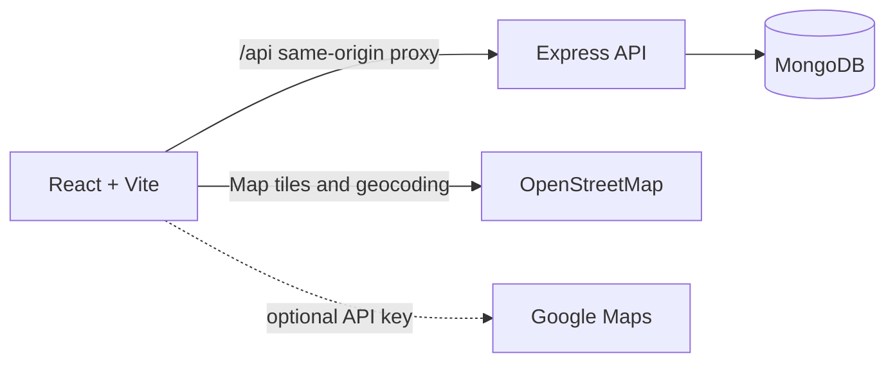

# Roomroot PG Search

<div align="center">
	<h1>Find a place that feels like yours.</h1>
	<p><strong>A PG discovery app for students near GLA University.</strong></p>
	<p>
		
		
		
		
		
	</p>
</div>

<p align="center">
	
</p>

Roomroot helps students find a stay by name, neighborhood, rent, and amenities. Owners can list a PG, manage enquiries, and follow listing reviews. The app includes a responsive React frontend, Express API, and MongoDB-backed data.

## Highlights

| Discover | Manage | Stay informed |
| --- | --- | --- |
| PG search by name and location | Student and owner accounts | Enquiry message threads |
| Rent, gender, and amenity filters | Saved and recently viewed PGs | In-app notifications |
| Nearby PGs with distance and map | Reviews and owner listing tools | Safety reports |
| Interactive map markers | Admin approval queue | Secure logout and password changes |

The map uses Google Maps when `VITE_GOOGLE_MAPS_API_KEY` is set; otherwise, it uses an interactive OpenStreetMap preview. Enquiry messages are threaded, but are not live Socket.io chat. Listing images currently use URLs rather than direct uploads.

## Quick Start

### Requirements

- Node.js `20.19+` or `22.12+`, with npm
- Docker Desktop, or a MongoDB server reachable through `MONGODB_URI`

### Run locally

```bash
git clone https://github.com/adityasingh4441/PG-Search-Application.git
cd PG-Search-Application
cp .env.example .env
```

Edit `.env`: set a long `JWT_SECRET` and a throwaway `SEED_PASSWORD`. Then start the database and app:

```bash
docker compose up -d mongo
npm install
npm run seed
npm run dev
```

Open the frontend URL printed by Vite, normally [http://localhost:5173](http://localhost:5173). If that port is already in use, Vite may select another one; the same-origin `/api` proxy keeps the frontend connected. Check API health at `/api/health`.

### Demo accounts

The seed script creates these local accounts. All three use the `SEED_PASSWORD` value from `.env`.

| Role | Email |
| --- | --- |
| Admin | `admin@roomroot.local` |
| Owner | `owner@roomroot.local` |
| Student | `student@roomroot.local` |

New students and owners can also register in the app. Admin accounts are not available through public registration.

## Architecture



The project is organized as npm workspaces: `frontend/` contains the React app, and `backend/` contains the REST API and MongoDB models.

## Environment

| Variable | Purpose | Default |
| --- | --- | --- |
| `PORT` | Express API port | `4000` |
| `CLIENT_ORIGIN` | Comma-separated allowed origins for direct API requests | Local Vite ports `5173` and `5174` |
| `MONGODB_URI` | MongoDB connection string | `mongodb://127.0.0.1:27017/pg_search` |
| `JWT_SECRET` | JWT signing secret | Development fallback; replace it outside local development |
| `SEED_PASSWORD` | Shared password for seeded accounts | Required by `npm run seed` |
| `BACKEND_URL` | Target for the Vite `/api` development proxy | `http://localhost:4000` |
| `VITE_API_URL` | Optional direct API URL; normally leave as `/api` | `/api` |
| `VITE_GOOGLE_MAPS_API_KEY` | Optional Google Maps key; OpenStreetMap is used when unset | Unset |

Vite reads `VITE_` values at build time. Development requests use the Vite proxy. In production, route `/api` through a same-origin reverse proxy or set `VITE_API_URL` to the deployed API URL. To configure frontend values, copy `frontend/.env.example` to `frontend/.env.local`. Restrict Google Maps keys to the deployed referrers.

## API Overview

| Area | Main endpoints |
| --- | --- |
| Authentication | `POST /api/auth/register`, `POST /api/auth/login`, `POST /api/auth/logout`, `GET /api/auth/me` |
| PG discovery | `GET /api/pgs`, `GET /api/pgs/nearby`, `GET /api/pgs/:id`, `GET /api/pgs/:id/reviews`, `GET /api/pgs/favorites` |
| Owner listings | `POST /api/pgs`, `GET /api/pgs/mine`, `PUT/DELETE /api/pgs/:id` |
| Enquiries | `POST/GET /api/enquiries`, `POST /api/enquiries/:id/messages`, `PATCH /api/enquiries/:id/status` |
| Profile | `GET/PATCH /api/profile`, `PATCH /api/profile/password`, `GET /api/profile/reviews`, `GET/POST /api/profile/recently-viewed` |
| Activity | `GET /api/notifications`, `GET/POST /api/reports` |
| Admin | `GET /api/admin/pgs/pending`, `PATCH /api/admin/pgs/:id/approve`, `/reject` |

Search supports `q`, `name`, `area`, `minRent`, `maxRent`, `gender`, `amenity`, `amenities`, `sort`, `page`, and `limit`. Sort values: `newest`, `price_asc`, `price_desc`, and `rating`.

## Scripts

| Command | Purpose |
| --- | --- |
| `npm run dev` | Start the API and frontend together |
| `npm run seed` | Add demo accounts and six approved sample PGs |
| `npm run build` | Build the frontend for production |
| `npm start` | Start the backend API |

## Production Notes

Set unique secrets and database credentials in the host environment, configure `CLIENT_ORIGIN` for direct cross-origin requests, and serve traffic over HTTPS. The local seed password and development JWT fallback are not production credentials. Direct image uploads, advanced report moderation, refresh-token rotation, real-time chat, tests, monitoring, and deployment automation are outside this MVP's scope.